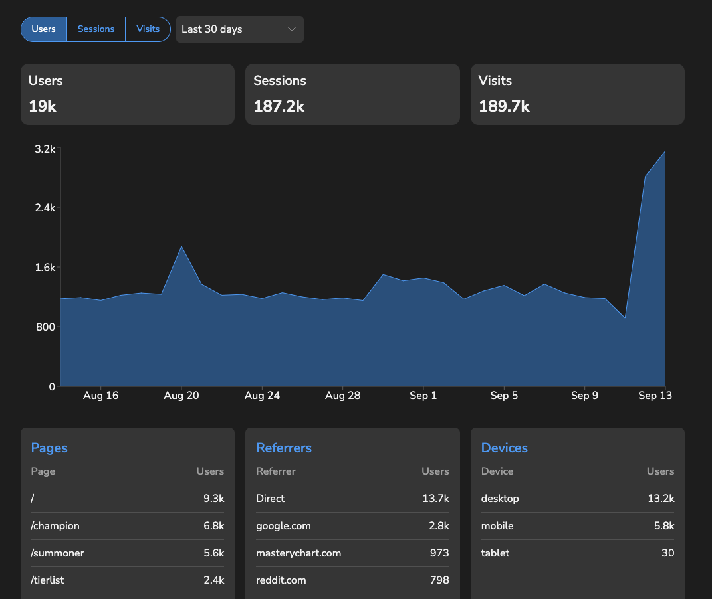

# Phinxer Web Analytics

[Phinxer](https://phinxer.com/) is a web analytics tool that uses ClickHouse for data storage and analysis.

An alternative to Google Analytics, Plausible, Fathom, Simple Analytics, Matomo and others.


*Phinxer Dashboard Preview*

## Prerequisites

Before you begin, ensure you have the following installed:

- Node.js
- Yarn package manager
- PostgreSQL database
- ClickHouse database

## Installation

1. Clone the repository
2. Install dependencies:
   ```
   yarn
   ```

## Environment Setup

1. Copy the `.env.template` file to `.env`:
   ```
   cp .env.template .env
   ```
2. Fill in the required environment variables in the `.env` file:
   - `DB_HOST`, `DB_NAME`, `DB_USERNAME`, `DB_PASSWORD`: PostgreSQL database connection details
   - `CLICKHOUSE_HOST`, `CLICKHOUSE_PASSWORD`, `CLICKHOUSE_DATABASE`: ClickHouse database connection details
   - `JWT_SECRET`: A random secret for JWT token generation
   - Other optional variables for Resend and Stripe integration

## Running the Project

### Development Mode

To run the project in development mode:

```
yarn dev
```

This will start the server on `http://localhost:3236` (or the port specified in your .env file).

### Production Mode

To run the project in production mode:

1. Build the project:
   ```
   yarn build
   ```
2. Start the server:
   ```
   yarn start
   ```

## Optional Services

### Resend (for email invitations)

If you want to enable email invitations, sign up for a Resend account and add your API key to the `RESEND_API_KEY` variable in the `.env` file.

### Stripe (for payments)

To enable Stripe integration:

1. Sign up for a Stripe account
2. Add the following variables to your `.env` file:
   - `STRIPE_SECRET_KEY`
   - `STRIPE_WEBHOOK_SECRET`
   - `STRIPE_PUBLISHABLE_KEY`

## Note

Make sure both PostgreSQL and ClickHouse databases are running and accessible before starting the application.
